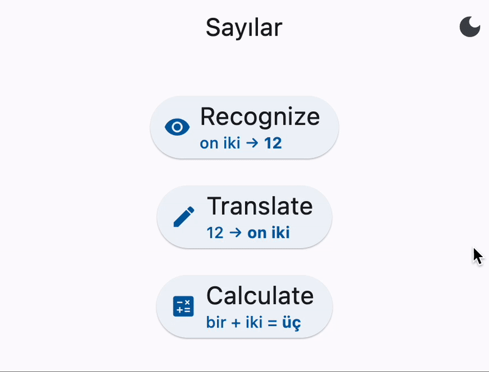

# Sayılar

*Sayılar* (Turkish for "numbers") is an app with simple exercises for practicing
Turkish numbers.



## About

This app has different simple exercises for practicing recognizing and using
Turkish numbers.
It aims to be as minimal as possible, as it is only a little side project.
It arose from myself learning Turkish and wanting a better way to practice their
numbers.

There are still a few improvements and new exercises planned (see the
[issues](https://github.com/JimGerth/sayilar-flutter/issues)) and eventually
this app is planned to be available for download, but there is no timeline for
that yet.


## Exercises

This app mainly focuses on exercises in which the use of numbers is trained.

### Numbers

Currently there are three such exercises available, which are described in the
following.

#### Recognize

For this exercise, the user is presented with a number written out in Turkish
(e.g. _"on iki"_), which they have to recognize and understand to answer with
the correct numerical value (e.g. _12_).

#### Translate

In effect, this exercise is the opposite of the previous one.
Here, the user is presented with a numerical value (e.g. _12_), which they have
to translate into and write out in Turkish (e.g. _"on iki"_).

#### Calculate

For this exercise, the user is presented with two numbers written out in Turkish
and combined with a mathematical opertaion (e.g. _"bir + iki"_).
Firstly, the user has to recognize each number to get their respective numerical
values in order to be able to perform the calculation (e.g. _1 + 2 = 3_).
Secondly, the user has to translate and write out the answer to the calculation
in Turkish (e.g. _"üç"_).
Thus, this is a combination of the first two exercises, as both recognizing and
translating are trained.

### Time

Since telling the time mainly consists of using numbers, there are now two
exercises for this as well.

#### Recognize

Analogous to the exercise for recognizing numbers (mentioned above), the user is
presented with a time written out in Turkish (e.g. _"saat on üç"_), which they
have to recognize and understand to answer with the correct numerical value
(e.g. _13:00_).

These can get more complex, for example _"saat on sekize çeyrek var"_ is _17:45_
and _"saat yirmi üçü on altı geçiyor"_ is _23:16_.

Eventually the app is supposed to include some material explaining to the user
how times are translated into turkish (see
[this tracking issue](https://github.com/jimgerth/sayilar-flutter/issues/13)),
but for now the user has to get that information elsewhere.

#### Translate

Again, analogous to the exercise for translating numbers (mentioned above), this
exercise is the opposite of the previous one.
Here, the user is presented with a numerical time value (e.g. _13:00_), which
they have to translate into and write out in Turkish (e.g. _"saat on üç"_).

### Random

In each category, the user has the option to randomly shuffle questions of all
exercises available in that category.
There is also a random exercise on the home page, with which all (number _and_
time) questions can be shuffled.

This way, all of the skills can be trained together and the context switch
between the different question types can help to consolidate the knowledge.


## Run

You need to have
[`flutter` installed](https://docs.flutter.dev/get-started/install)
to run this app by doing
```sh
git clone https://github.com/JimGerth/sayilar-flutter.git
cd sayilar-flutter
flutter run
```
